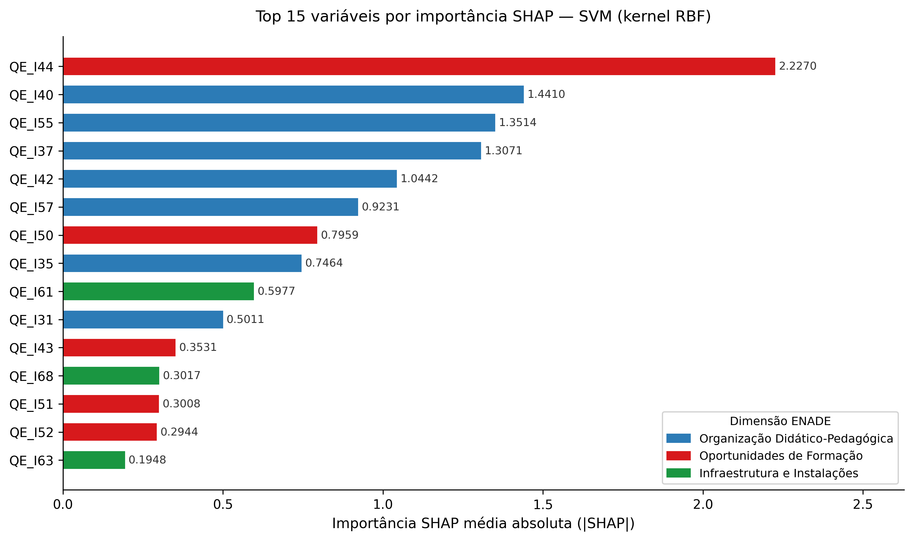

# 🎓 Fatores Associados à Permanência Acadêmica em Cursos de Computação: Análise Preditiva e Interpretável com Dados do ENADE

> Trabalho de Conclusão de Curso — Ciência da Computação · UNIVASF · Campus Salgueiro · 2026  
> Orientadora: Profa. Me. Débora da Conceição Araújo

[](https://www.python.org/)
[](https://scikit-learn.org/)
[](https://shap.readthedocs.io/)
[](LICENSE)
[]()

---

## 📌 Sobre o Projeto

Este repositório contém o código desenvolvido para o TCC que investiga a predição da **Taxa de Aprovação (TAP)** em cursos de Computação utilizando dados do **ENADE** (Exame Nacional de Desempenho dos Estudantes).

O estudo compara cinco algoritmos de aprendizado de máquina e aplica análise de interpretabilidade com **SHAP (SHapley Additive exPlanations)** para identificar quais variáveis do Questionário do Estudante (QE) mais influenciam a retenção acadêmica — contribuindo com evidências acionáveis para gestores e formuladores de políticas educacionais.

---

## 🧪 Modelos Comparados

| Modelo | RMSE (CV) | RMSE (Teste) | MAE (Teste) | R² (Teste) |
|---|---|---|---|---|
| **SVM (RBF)** ⭐ | 14.62 ± 0.12 | **14.65** | **12.02** | 0.111 |
| Ridge | 14.61 ± 0.15 | 14.68 | 12.19 | 0.107 |
| Random Forest | 14.63 ± 0.15 | 14.75 | 12.31 | 0.099 |
| MLP | 14.75 ± 0.14 | 14.86 | 12.17 | 0.086 |
| Decision Tree | 15.00 ± 0.15 | 15.11 | 12.65 | 0.054 |

> ⭐ O **SVM com kernel RBF** (`C=1`, `epsilon=0.05`, `gamma=scale`) obteve o melhor desempenho no conjunto de teste e foi selecionado para a análise SHAP.

---

## 🔍 Análise de Interpretabilidade (SHAP)

A análise SHAP foi aplicada ao modelo SVM para identificar as variáveis com maior influência média absoluta sobre as predições de TAP.

### Top 15 Questões mais Relevantes



### Importância por Dimensão ENADE

| Dimensão | Importância SHAP (SVM) | Importância (Random Forest) |
|---|---|---|
| Organização Didático-Pedagógica | **8.26** | **56.4%** |
| Oportunidades de Formação | 4.01 | 23.7% |
| Infraestrutura e Instalações | 1.45 | 19.9% |

> A dimensão **Organização Didático-Pedagógica** domina ambos os métodos de interpretabilidade, evidenciando que a qualidade do ensino — não apenas a infraestrutura — é o principal fator associado à retenção estudantil.

---

## 📁 Estrutura do Repositório

```
.
├── analise_tap.py              # Pipeline principal: pré-processamento, GridSearchCV e avaliação
├── analise_shap_svm.py         # Análise SHAP sobre o modelo SVM selecionado
├── analise_completa_tap.json   # Resultados consolidados de todos os modelos
├── analise_completa_shap.json  # Importâncias SHAP por QE e por dimensão
├── dataset/
│   └── dataset_COMP_VF.xlsx    # Dataset ENADE — cursos de Computação
├── figuras/
│   └── shap_top15_qes.png      # Gráfico: Top 15 variáveis por importância SHAP
└── codigo/
    ├── melhor_svm.pkl           # Pipeline SVM serializado (melhor modelo)
    ├── shap_values.npy          # Valores SHAP pré-calculados
    └── amostra_teste_shap.pkl   # Amostra de teste usada na análise SHAP
```

---

## ⚙️ Como Executar

### 1. Clone o repositório

```bash
git clone https://github.com/Gabrielgfr/tcc-tap-ml.git
cd tcc-tap-ml
```

### 2. Instale as dependências

```bash
pip install pandas numpy scikit-learn shap joblib matplotlib openpyxl
```

### 3. Execute a análise principal

```bash
python analise_tap.py
```

Esse script realiza a leitura do dataset, split treino/teste, GridSearchCV com validação cruzada (5-fold) para todos os modelos, avaliação no conjunto de teste e exportação dos resultados para `analise_completa_tap.json`. O modelo SVM selecionado é salvo em `codigo/melhor_svm.pkl`.

### 4. Execute a análise SHAP

```bash
python analise_shap_svm.py
```

Carrega o pipeline SVM salvo e calcula os valores SHAP via `KernelExplainer` (com background `shap.kmeans`). Gera o gráfico `figuras/shap_top15_qes.png` e exporta as importâncias para `analise_completa_shap.json`.

> **Nota:** O cálculo SHAP via `KernelExplainer` é computacionalmente intenso. Na primeira execução, os valores são salvos em `codigo/shap_values.npy` para reaproveitamento nas execuções seguintes.

---

## 🗂️ Dados

Os dados utilizados são provenientes do **ENADE**, disponibilizados pelo INEP, e foram filtrados para cursos da área de **Computação**. O arquivo `dataset_COMP_VF.xlsx` contém as respostas ao Questionário do Estudante (colunas `QE_I*`) e a variável-alvo `TAP` (Taxa de Aprovação por curso).

As questões são agrupadas em três dimensões:

| Dimensão | Questões (QE_I) |
|---|---|
| Organização Didático-Pedagógica | 27–42, 47, 48, 54–58 |
| Oportunidades de Formação | 43–46, 49–53 |
| Infraestrutura e Instalações | 59–68 |

---

## 📊 Metodologia Resumida

```
Dados ENADE (QE_I*)
        ↓
  Seleção de features + tratamento de missing (moda)
        ↓
  Split 80/20 (random_state=42)
        ↓
  GridSearchCV (5-fold, neg_MSE) para cada modelo
        ↓
  Avaliação no conjunto de teste (MSE, RMSE, MAE, R²)
        ↓
  Seleção do melhor modelo (SVM)
        ↓
  KernelExplainer SHAP → importância por QE e por dimensão
```

---

## 👤 Autor

**Gabriel Ferreira Rodrigues**  
Graduando em Ciência da Computação — UNIVASF  

[](https://github.com/Gabrielgfr)
[](https://linkedin.com/in/gabriel-ferreira-roodrigues)
